# Human-governed LLM research process

- **Status:** Active for bounded design and public-source research; experiment and production gates remain inactive.
- **Owner:** Workspace requester acting as research lead.
- **Applies to:** Discovery, evidence integration, synthesis, theory cards, evaluation design, experiments, conclusions, and adoption recommendations.
- **Principle:** The LLM may retrieve, extract, normalize, propose, and challenge. An authorized human controls promotion and consequential action.

## Operating model

```mermaid
flowchart LR
  H0["Human G0: scope and authority"] --> C["Bounded evidence context"]
  C --> P["Versioned evaluable prompt"]
  P --> M["LLM retrieval, analysis, and draft"]
  M --> V["Deterministic validation and independent challenge"]
  V --> H1["Human G1/G2: evidence and synthesis decision"]
  H1 -->|Revise or reject| C
  H1 -->|Approved research direction| H3["Human G3/G4: preregistration and execution authority"]
  H3 --> E["Frozen experiment and holdout"]
  E --> H5["Human G5: result promotion"]
  H5 --> H6["Human G6: adoption or communication"]
```

Passing a gate authorizes only its recorded action. The model cannot approve its own source, theory, experiment, result, or production recommendation.

## Roles and separation of duties

| Role | Decision right | Required when |
|---|---|---|
| Research lead | Scope, priority, and research budget | Every cycle |
| Evidence reviewer | Admit or quarantine material evidence | G1 and evidence-sensitive G2 |
| Methodology reviewer | Accept comparisons, metrics, and falsifiers | G2 through G5 |
| Experiment owner | Operational responsibility for an approved run | G4 |
| Holdout custodian | Protect hidden cases and unblinding | G3 through G5 |
| Independent evaluator | Score without author or expected-answer leakage | G5 |
| Safety/privacy reviewer | Approve sensitive data and risk controls | Any private or consequential work |
| Adoption owner | Accept product, policy, cost, and rollback risk | G6 |

Unassigned optional roles do not block public-source discovery. An unassigned role required by the requested gate blocks promotion or execution.

`HUMAN_DECISION_AGENT_COUNCIL.md` adds three core AI advisors—Gate Navigator, Evidence and Methods Challenger, and Boundary Sentinel—plus optional blinded scoring support and a deterministic Gate Clerk. These roles prepare, challenge, route, and record; they never count toward human concurrence or acquire a human decision right.

Low-risk public-source G0 requires one accountable human. Sensitive G1 and all G2-G6 decisions require the accountable owner plus a distinct eligible human reviewer, with additional privacy, security, legal, holdout, operational, or adoption concurrence when that boundary is engaged. Conflicted authors, runners, unblinded participants, post-hoc metric changers, and materially interested parties must recuse from the affected concurrence role.

## Gate ladder

| Gate | Human decision | Required record | Exit condition |
|---|---|---|---|
| G0 Scope | Question, authority, source boundary, budget, stop rules | Gate record and next action | Named owner approves or conditions scope |
| G1 Evidence | Admit, reject, or quarantine sources and claims | Evidence ledger delta and contradiction register | Provenance and unresolved fields are explicit |
| G2 Synthesis | Accept profiles, taxonomy, comparison, or conclusion | Versioned synthesis and dissent | Strongest countercase is represented |
| G3 Preregistration | Approve hypothesis, arms, metrics, falsifiers, holdout | Frozen preregistration | No post-hoc metric or hypothesis ambiguity |
| G4 Execution | Authorize data, tools, workload, spend, and effects | Execution manifest and rollback | Required owners and controls are assigned |
| G5 Promotion | Reject, revise, replicate, or provisionally promote | Result card and independent review | Validation and replication threshold are met |
| G6 Adoption | Approve production, policy, purchase, or publication | Decision record and monitoring plan | Operational evidence and rollback are accepted |

## Per-cycle procedure

1. **Open G0.** Record one decision, owner, boundary, source classes, budget, expiry, and prohibited actions.
2. **Build a context pack.** Use `$engineer-evidence-context`. Prefer canonical and primary evidence; include conflicts, negative results, material unknowns, and an exclusion log.
3. **Freeze the prompt contract.** Use `$design-evaluable-research-prompts`. State outcome, evidence rules, success and failure, authority, output, validation, and stop/fallback behavior.
4. **Execute bounded model work.** Preserve source locations, versions, units, denominators, comparators, and unavailable telemetry. Stop on novelty, validity, safety, privacy, or budget triggers.
5. **Validate.** Run deterministic schema and reference checks, then an independent challenge appropriate to the claim. Same-model self-critique is useful but not independent approval.
6. **Route one decision packet.** Use `HUMAN_DECISION_AGENT_COUNCIL.md` and `$govern-human-ai-research`. Preserve advisor disagreement, check human eligibility and recusal, and ask one narrow human question.
7. **Validate and record.** The deterministic Gate Clerk records an explicit eligible-human decision, conditions, dissent, expiry, reversal evidence, and any required external terminal-event checkpoint attestation; it never infers approval.
8. **Handoff exactly one action.** State owner, allowed and forbidden work, budget, inputs, output, validation, and next gate.

## Context-engineering contract

Every context pack must identify:

- the decision and consuming gate;
- canonical state and immutable evidence versions;
- authorized and forbidden actions;
- facts, reported claims, inferences, proposals, contradictions, and unknowns as separate classes;
- source inclusion and exclusion rationale;
- freshness, budget, expected output, validation, and stop rules; and
- what must survive compaction or handoff.

Retrieve exact excerpts only when they can affect the decision. Keep raw evidence outside prompts when stable pointers suffice. Use allowlisted inputs for closed evaluations, and never leak expected answers or holdout labels to workers.

## Prompt-engineering contract

Every consequential prompt must be versioned and traceable to a gate and context pack. It must:

- lead with an observable outcome;
- state authority once;
- separate instructions from evidence;
- define measurable acceptance and failure;
- require counterevidence and uncertainty;
- prohibit unsupported production or novelty claims;
- avoid hidden-chain-of-thought requests; and
- freeze evaluation before execution.

For model-routing research, preserve single-model, static-router, and dynamic-router comparators unless a gate explicitly narrows the question. Compare quality, latency, cost, reliability, safety, observability, carbon, and human maintenance without merging incompatible settings.

## Scientific-integrity controls

- Preregister hypotheses, falsifiers, arms, metrics, exclusions, and analysis before G4.
- Separate training, calibration, validation, and holdout ownership.
- Blind evaluators to workflow identity when feasible.
- Preserve null, negative, interrupted, and failed-validation outcomes.
- Require replication before strong promotion and customer-grade evidence before production claims.
- Version prompts, context, code, data, model identity, tool configuration, and pricing assumptions.
- Use supersession records; never silently overwrite a rejected theory or frozen result.
- Expire approvals when inputs, models, data distributions, costs, policies, or risks materially change.

## Current workspace application

`research/decisions/GATE-001-gar-public-source-integration.md` completed its bounded GAR delta and stopped on Agora materiality. `research/decisions/GATE-002-agora-public-source-integration.md` is now proposed with zero authority until the workspace requester supplies one explicit decision. Experiments, private data, paid retrieval, code execution, automated scheduling, theory promotion, Stage 2 transition, and production adoption remain forbidden.
