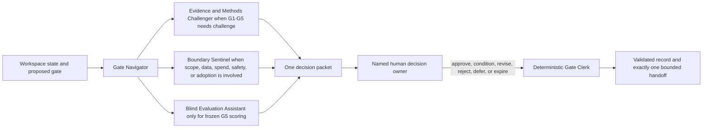

# Human Decision Agent Council

- **Status:** Active as an advisory workflow
- **Authority:** Preparation, challenge, routing, and recording only
- **Human control:** Every G0-G6 decision remains with the named human owner
- **Default:** Invoke the smallest set of agents needed for the current gate

## Purpose

The council reduces the cognitive and administrative load of human research decisions. Advisory agents prepare a bounded decision packet, expose disagreement and missing evidence, and convert a signed decision into one auditable handoff. They do not vote, approve, or substitute for required human reviewers.

## Advisory agents

| Agent | Invoke when | Human counterpart | Cannot do |
|---|---|---|---|
| Gate Navigator | Every new or changed gate | Decision owner or research lead | Decide the gate or infer approval from silence |
| Evidence and Methods Challenger | Material evidence, synthesis, preregistration, or results require challenge | Evidence and methodology reviewers | Admit evidence, change frozen metrics, accept validity, or promote a result |
| Boundary Sentinel | Authority, privacy, safety, budget, operations, or adoption could expand | Safety/privacy, experiment, budget, or adoption owner | Grant authority or waive a stop condition |
| Blind Evaluation Assistant | Frozen outputs require G5 scoring | Independent evaluator | Claim independence merely because a new prompt or session was used |
| Gate Clerk | A named human supplies an explicit decision | Decision owner | Make judgments; it only validates schema, identity, eligibility, hashes, budget, expiry, signature, and checkpoint sequencing |

The core council is three AI advisors: Gate Navigator, Evidence and Methods Challenger, and Boundary Sentinel. Blind Evaluation Assistant is optional G5 calculation support. Gate Clerk is deterministic rather than an LLM advisor. Role cards live in `research/agents/`. Same-model critique is advisory even when run in another task. Human or organizational independence must be established separately.

## Human responsibility matrix

| Gate | Accountable human | Required human review or custody | Minimum decision condition |
|---|---|---|---|
| G0 Scope | Research lead or named decision owner | Safety/privacy reviewer when sensitive boundaries are proposed | One scoped decision, budget, expiry, prohibited actions, and stop rules |
| G1 Evidence | Evidence reviewer | Data owner for restricted sources | Sources are admitted, quarantined, or rejected with provenance |
| G2 Synthesis | Named synthesis owner | Evidence and methodology reviewers for material claims | Counterevidence, incompatible settings, and dissent are visible |
| G3 Preregistration | Methodology owner | Holdout custodian | Arms, metrics, falsifiers, exclusions, analysis, and unblinding are frozen |
| G4 Execution | Experiment owner | Budget/operations owner and safety/privacy reviewer when applicable | Tools, data, spend, rollback, and kill conditions are authorized |
| G5 Promotion | Named promotion owner | Independent evaluator; methodology reviewer | Author and runner are not the sole reviewers; replication rule is applied |
| G6 Adoption | Adoption owner | Operations, cost, safety/privacy, legal, or communications owners as applicable | Deployment or publication scope, monitoring, rollback, and reversal evidence are accepted |

An unassigned role blocks only the gate that requires it. It does not block reversible preparation already authorized by an earlier gate.

## Human concurrence and recusal

- Low-risk public-source G0 requires one accountable human decision owner with an explicit conflict declaration.
- Sensitive G1 and all G2-G6 decisions require the accountable owner plus one distinct eligible human reviewer; privacy, security, legal, holdout, or operational vetoes apply when their boundary is engaged.
- AI advisors never count toward human concurrence. Multiple personas, tasks, models, or agent votes do not create a human quorum.
- Theory and synthesis authors, experiment runners, anyone exposed to holdout labels, anyone changing metrics after results, and people with material vendor or financial incentives must disclose and recuse from any affected accountable or concurrence role. A conflicted sole G0 owner cannot approve; the gate remains `in_review` or `deferred` until a named eligible alternate is assigned through a superseding record.
- Broken concurrence fails closed to `in_review` or `deferred`. Escalation goes only to a pre-named eligible human alternate through a superseding record and cannot skip gates.
- Every approval is capability-bound to gate ID, allowed actions, data/source boundary, tools, budget, owner, expiry, and stop conditions. Material evidence, model, data, cost, or policy changes reopen review.

## Decision-routing procedure

1. **Detect the gate.** The Gate Navigator identifies the single consequential decision and checks whether the previous gate still grants preparation authority.
2. **Select advisors.** Invoke only the Evidence and Methods Challenger, Boundary Sentinel, or optional evaluation assistant needed by the gate. Role count is not evidence quality.
3. **Build one packet.** Use `workflows/templates/HUMAN_DECISION_PACKET.md`. Preserve disagreements rather than forcing consensus.
4. **Run completeness checks.** Run `python3 scripts/validate_gate.py <gate-files>` and `python3 scripts/validate_handoffs.py`. Missing owner, stale evidence, required reviewer, budget, expiry, stop rule, reversal evidence, unique handoff ID, valid consumption state, or required prior-terminal checkpoint leaves the packet `blocked` or `proposed`.
5. **Ask one human question.** Present options and consequences. Silence, inactivity, an agent majority, or a prior broad request never counts as approval.
6. **Record the signed outcome.** The deterministic Gate Clerk validates the owner, conflict declaration, eligibility, hashes, budget, expiry, schema, explicit signature, and prior terminal-event checkpoint before updating the durable gate without overwriting earlier states. It issues one uniquely identified consumable handoff; completion, budget exhaustion, expiry, or any stop trigger consumes and revokes that authority. Local checkpoint files are tamper-evident, while the human's external decision message supplies the independent attestation reference.
7. **Issue one handoff.** State newly authorized work, still-forbidden work, owner, budget, expiry, validation, and first stop condition.

## Separation, dissent, and escalation

- The evidence author may challenge evidence but cannot be the only G1 reviewer.
- The theory or prompt author cannot be the only G3 or G5 reviewer.
- The experiment runner cannot control the holdout or unblinding.
- The same agent may not prepare the substantive recommendation and then represent that recommendation as independent review.
- A reviewer conflict, unresolved material contradiction, crossed authority boundary, or expired evidence returns the gate to `in_review`, `revised`, or `deferred`.
- When reviewers disagree, the packet records each position, the disputed evidence, and the accountable human who must resolve it.

## Current invocation

For the Agora G0 scope decision, invoke only Gate Navigator and Boundary Sentinel, then use the deterministic Gate Clerk after the human response. Invoke Evidence and Methods Challenger during G1/G2, after the bounded delta produces evidence to review. Blind Evaluation Assistant is not relevant because no experiment or G5 promotion is authorized. The only current human decision is `GATE-002`: whether to authorize a bounded public-source Agora integration delta while explicitly attesting the prior consumed handoff checkpoint.
